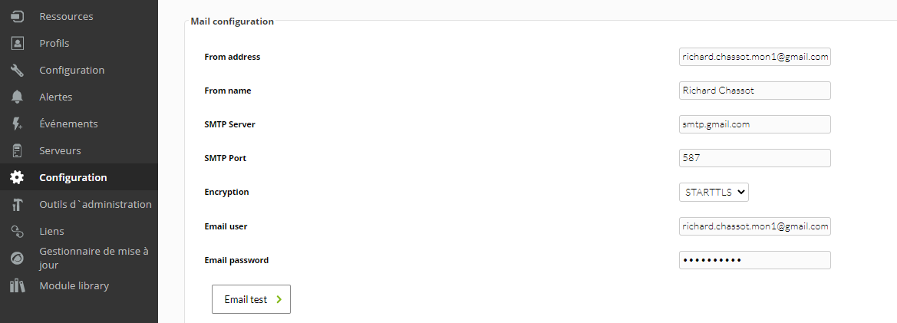

# Configuration de Pandora pour le smtp

Pour pouvoir utiliser postfix nous devons effectuer une petite configuration sur la console pandora:

Il suffit de clicker sur "Email test" pour tester notre configuration:

