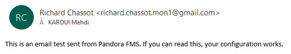

# Configuration PostFix \(alerte mail\)

Il faut se rendre dans le dossier /etc/postfix et éditer le fichier `main.cf`

```text
myhostname = pandora
relayhost = [smtp.gmail.com]:587
smtp_sasl_auth_enable = yes
smtp_sasl_password_maps = hash:/etc/postfix/sasl_passwd
smtp_tls_policy_maps = hash:/etc/postfix/tls_policy
smtp_sasl_security_options = noanonymous
smtp_use_tls = yes
smtp_tls_CAfile = /etc/pki/tls/cert.pem
smtp_tls_security_level = encrypt
```

Nous utilisons le serveur mail de google car c'est un service gratuit.

Nous devons maintenant créer le fichier qui contient les credentials pour accéder au compte gmail qui permettra d'envoyer les e-mail:

```text
nano /etc/postfix/sasl_passwd
[smtp.gmail.com]:587 Richard.chassot.mon1@gmail.com:PASSWORD
```


Notre mot de passe ne figure pas dans la documentation pour des raisons de sécurité


Il faut ensuite changer l'ownership du fichier ainsi que des droits de manière à le sécuriser:

```text
chmod 600 /etc/postfix/sasl_passwd
chown root:root /etc/postfix/sasl_passwd
```

Nous devons créer le fichier /etc/postfix/tls\_policy:

```text
[smtp.gmail.com]:587 encrypt
```

Puis le sécuriser en changeant l'ownership ainsi que les droits:

```text
chmod 600 /etc/postfix/tls_policy
chown root:root /etc/postfix/tls_policy
```

Il faut ensuite transformer les fichiers sasl\_passwd et tls\_policy en fichier de type hash indexés:

```text
postmap /etc/postfix/sasl_passwd && postmap /etc/postfix/tls_policy
```

Nous pouvons redémarrer le service et effectuer un test:

```text
sudo systemctl restart postfix
echo "This is an email test sent from Pandora FMS. If you can read this, your configuration works. " | mail mehdi.karoui@cpnv.ch

```

Et nous recevons bien l'e-mail:



