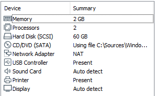

# Installation et configuration de la VM

## Spécifications matérielles



## Spécifications logicielles

L'installation standard d'un Windows Server Core par défaut étant connue, je ne documenterai pas l'installation.

Login : Administrator

Password : Pa$$w0rd

## Mise à jour de PowerShell V5 vers PowerShell V7

### Script update.powershell.ps1

```text
iex "& { $(irm https://aka.ms/install-powershell.ps1) } -UseMSI -Quiet"
UnInstall-WindowsFeature -Name PowerShell
ren "C:\Program Files\PowerShell\7\pwsh.exe" powershell.exe
Shutdown -r -t 0
```

### Explication du script

Dans un premier temps, nous installons la dernière version de PowerShell :

```text
iex "& { $(irm https://aka.ms/install-powershell.ps1) } -UseMSI -Quiet"
```

* `UseMsi` force l'utilisation du package `.msi`
* `Quiet`applique une installation silencieuse

Puis nous supprimons la version 5 qui est installée en tant que `Windows Feature`

```text
UnInstall-WindowsFeature -Name PowerShell
```

Afin de pouvoir utiliser la commande powershell.exe pour éxécuter la version 7 nous renommons `C:\Program Files\PowerShell\7\pwsh.exe`en `powershell.exe`.

```text
ren "C:\Program Files\PowerShell\7\pwsh.exe" powershell.exe
```

Pour terminer nous redémarrons le poste :

```text
Shutdown -r -t 0
```

