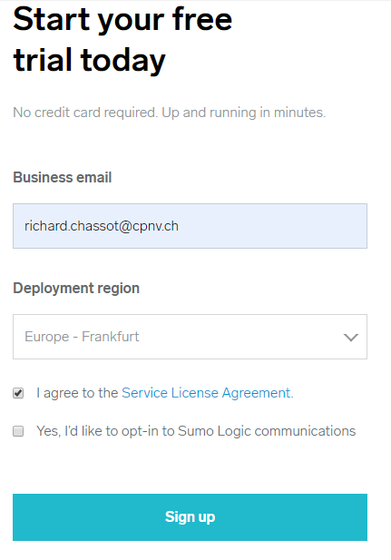
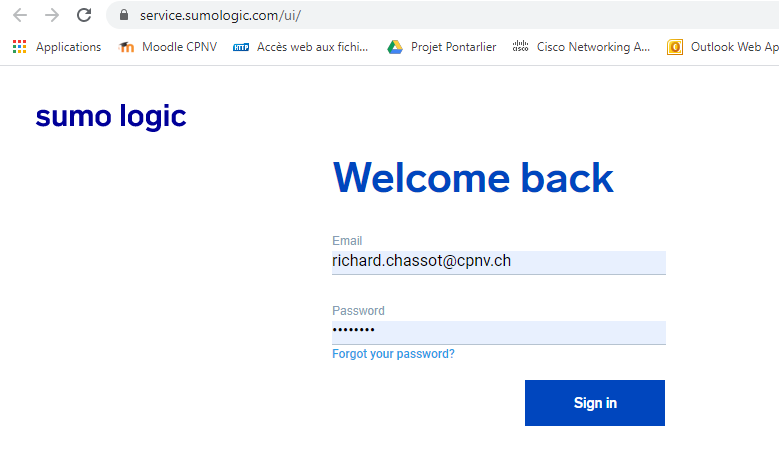
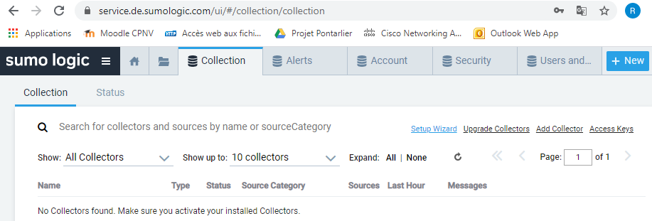
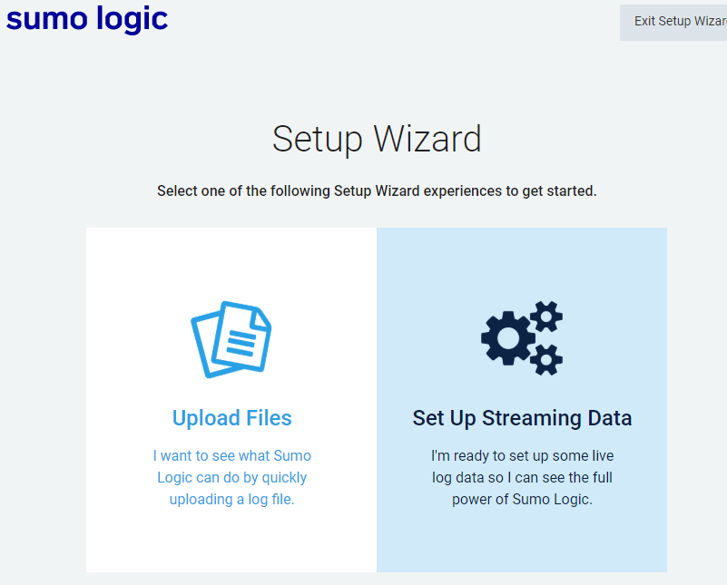
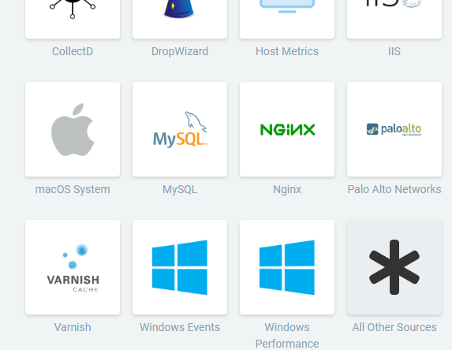
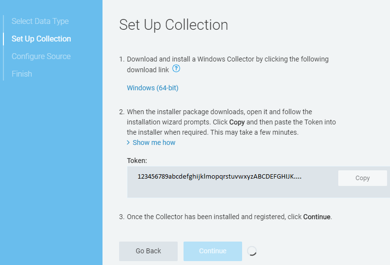
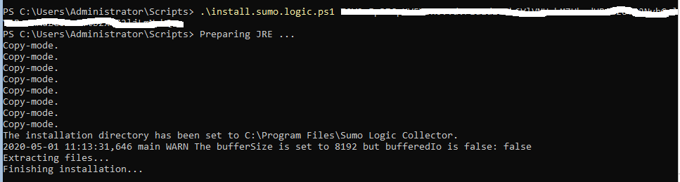
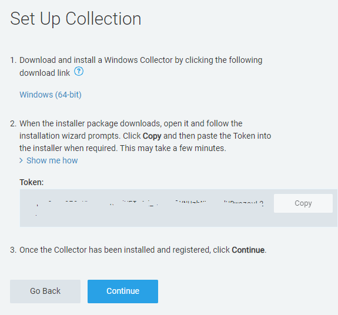
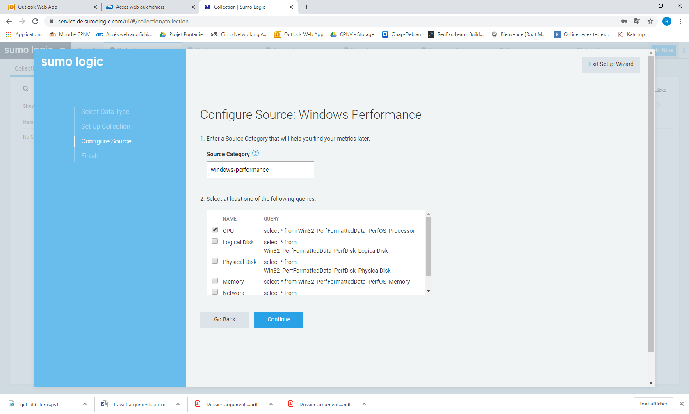
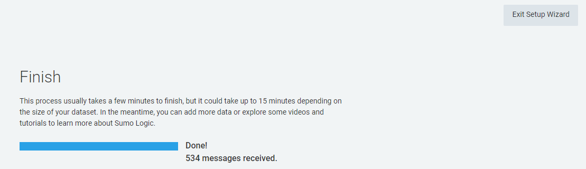

# Collecteur Sumo Logic

### Création d'un compte


* Start free trial



Remarque : une adresse professionnelle est exigée. Un compte gmail ou msn ne fonctionnera pas.

Une fois notre compte vérifié nous pouvons nous connecter :



* Sous l'onglet `Collection`sélectionner `Setup Wizard`



* Sélectionner Set Up Streaming Data



* Choisir `Windows Performance`





Comme nous avons préparé un script pour installer le collecteur, nous récupérons le `token` en le copiant afin de pouvoir l'injecter dans le script.

Sur notre serveur Core nous exécutons le script en y injectant notre `token` :



Lorsque l'installation est terminée nous pouvons continuer :



Nous pouvons choisir les différents compteurs :



Dans notre cas, nous nous arrêterons à observer le CPU.



Nous pouvons maintenant sortir du `Wizard`

Le CPU de notre serveur est maintenant suivit :


### Script install.sumo.logic.ps1

```text
# Auteur : Richard Chassot
# 
# Installe le collecteur Sumo Logic 
# 
# Utilisation : install.sumo.logic.ps1 <token>

Param ($token =".")
$source = "https://collectors.de.sumologic.com/rest/download/win64"
$destination = "C:\Users\Administrator\Downloads\SumoCollector_windows-x64_19_288-3.exe"
$fichier = New-Object System.Net.WebClient
$fichier.DownloadFile($source, $destination)

C:\Users\Administrator\Downloads\SumoCollector_windows-x64_19_288-3.exe -console -q "-Vsumo.token_and_url=$token"
```

### Explication du script

Dans un premier temps nous téléchargeons `SumoCollector_windows-x64_19_288-3.exe` en définissant les chemins de la sources et de la destination :

```text
Param ($token =".")
$source = "https://collectors.de.sumologic.com/rest/download/win64"
$destination = "C:\Users\Administrator\Downloads\SumoCollector_windows-x64_19_288-3.exe"
$fichier = New-Object System.Net.WebClient
$fichier.DownloadFile($source, $destination)
```

Remarque : Param \($token = "."\) nous permet d'injectet le token dans le script et de ne pas l'avoir inscrit à l'intérieur.

Puis nous exécutons `SumoCollector_windows-x64_19_288-3.exe` en installation silencieuse :

```text
C:\Users\Administrator\Downloads\SumoCollector_windows-x64_19_288-3.exe -console -q "-Vsumo.token_and_url=$token"
```

* -q -console force une installation silencieuse tout en affichant les sorties sur la console
* -Vsumo.token\_and\_url=$token définit le token injecté dans notre script

## 

