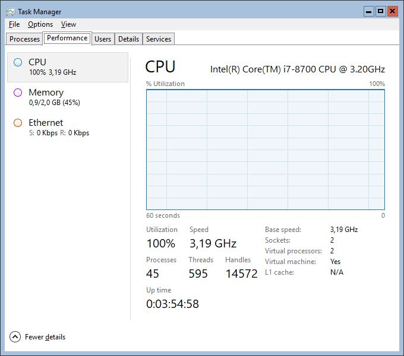
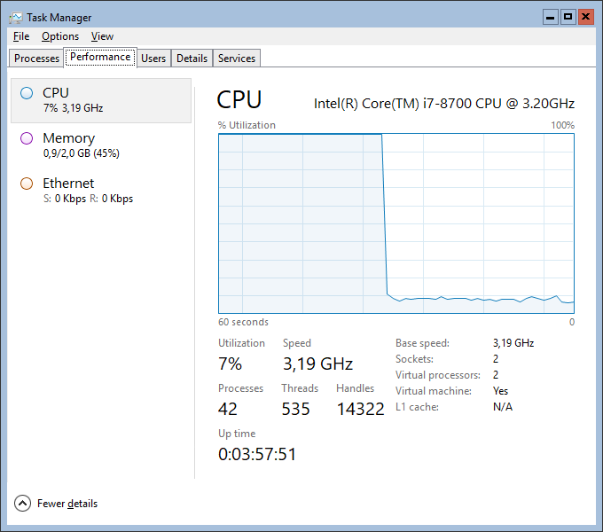

# Stress test

## Stress du CPU

### CONSUME.EXE - WINDOWS 2003 RESOURCE KIT UTILITY

#### Téléchargement et installation

Microsoft dispose d'un outil `consume.exe`pour répondre à ce besoin. Il est compris dans les `Windows Server 2003 Resource Kit Tools` que nous téléchargeons :

[https://www.microsoft.com/en-us/download/confirmation.aspx?id=17657](https://www.microsoft.com/en-us/download/confirmation.aspx?id=17657)

L'exécutable se trouve sous :

C:\Program Files \(x86\)\Windows Resource Kits\Tools

#### Utilisation

| Utility | Description |
| :--- | :--- |
| **Consume.exe - Memory Consumers Tool** | Used to simulate the consumption of machine resources such as physical memory, page file memory, disk space, CPU time and kernel pool for the purpose of stress tests. Works in Windows 2003 only. Switches: -physical-memory - Consumes physical memory so that applications are forced to operate on lowered amounts. -page-file - Uses up the page file. -disk-space - Uses up available disk space. -cpu-time - Uses up processor time by created 128 threads. -kernel-pool - Uses up as much of the kernel pool as possible. -time Seconds - Used in conjunction with the above, this switch specifies the amount of time to consume the specified resource. |

[https://www.activexperts.com/admin/reskit/reskit2003/consume/](https://www.activexperts.com/admin/reskit/reskit2003/consume/)

```text
C:\Users\Richard.CHASSOT>consume.exe /?
Universal Resource Consumer - Just an innocent stress program, v 0.1.0
Copyright (c) 1998, 1999, Microsoft Corporation

    consume RESOURCE [-time SECONDS]

RESOURCE can be one of the following:

    -physical-memory
    -page-file
    -disk-space
    -cpu-time
    -kernel-pool
```

### Pour contrôle

Avant le stress du CPU :


Nous stressons notre CPU :


```text
C:\Users\Administrator\Tools>consume.exe -cpu-time -time 300
Consume: Message: Time out after 300 seconds.
Consume: Message: Successfully assigned process to a job object ...
Consume: Message: Attempting to start 256 threads ...
..........................................................
```

En local :



Sur Sumo Logic :



Après arrêt du stress en local :

